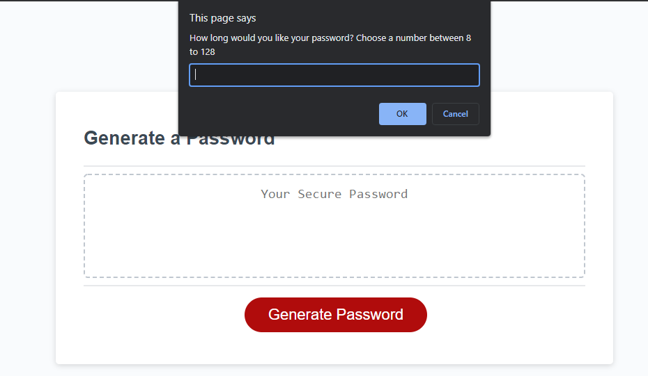
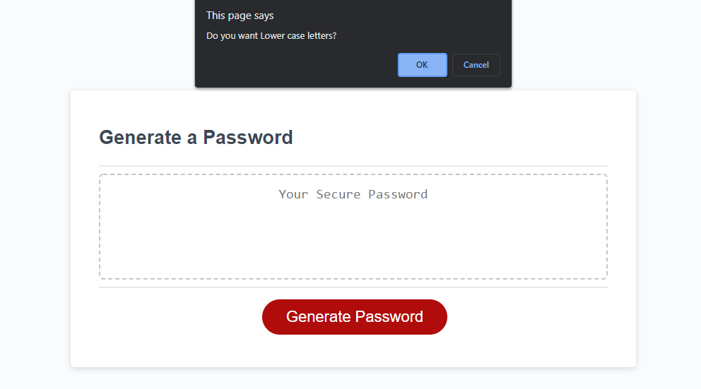
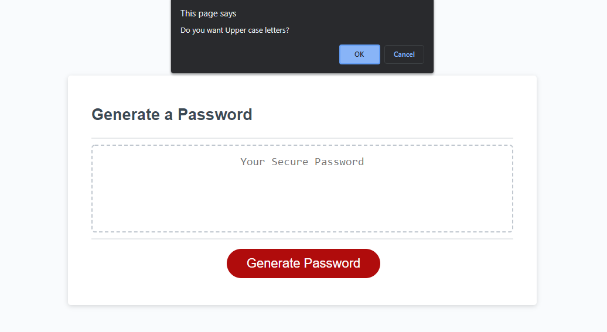
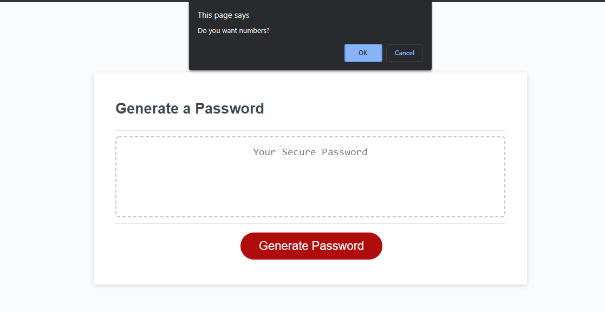
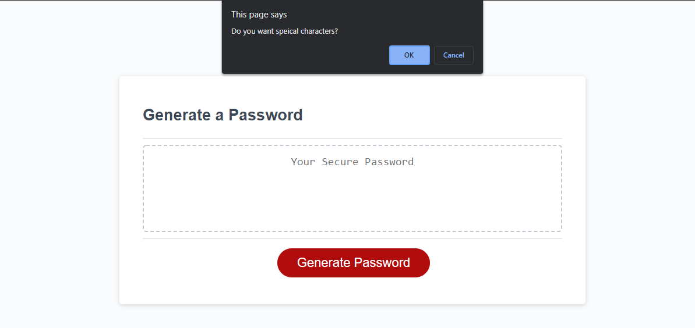
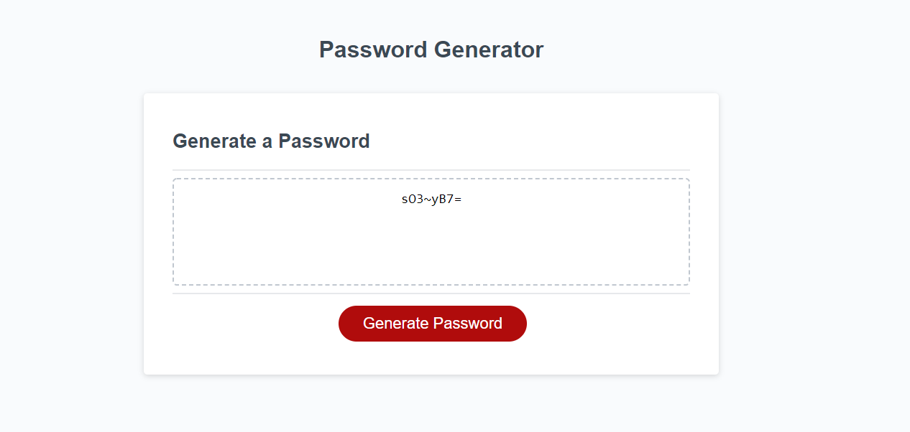
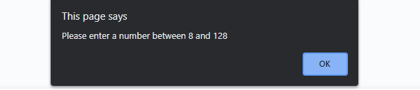

# Pass-Gen-Javascript-3

Deployed URL:https://albertcshih.github.io/Pass-Gen-Javascript-3/

Screenshots for different requirement prompts for password:

Password length prompt:

Lower case prompt:

Upper case prompt:

Number prompt:

Special characters prompt:

Generated password with 8 length:

Invalid input of length alert:
